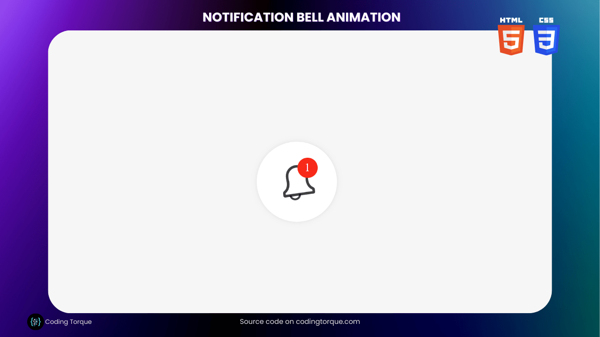

# web-demo-files

web 特效合集
Welcome to Coding Torque – your ultimate destination for all things web development and design! In this exhilarating journey, we are about to embark on a thrilling quest: crafting a mesmerizing Notification Bell Animation using nothing but the power of HTML and CSS.

Picture this – a sleek, modern bell icon adorning your website, ready to spring into life with every update, delivering a seamless and delightful user experience. Gone are the days of static, mundane notifications. Today, we rise to the challenge of bringing our designs to life, captivating users with an animation that commands attention and sparks intrigue.

Whether you’re a curious coder seeking to level up your skills or a design aficionado eager to add that extra touch of magic to your website, this tutorial is tailor-made for you. Guided by our expert developers, you’ll unveil the secrets behind creating smooth, elegant animations that dance with the rhythm of your users’ interactions.

But hold onto your seats, for our exploration goes beyond the technical realm. We’ll delve into the psychology of user engagement, understanding how subtle animations can elevate your website’s impact and foster lasting connections with your audience.

So, buckle up and get ready to harness the prowess of HTML and CSS as we venture into the realm of Notification Bell Animation. Let’s unleash the full potential of your web projects and breathe life into your designs. Ready to code with torque? Let’s dive in!

